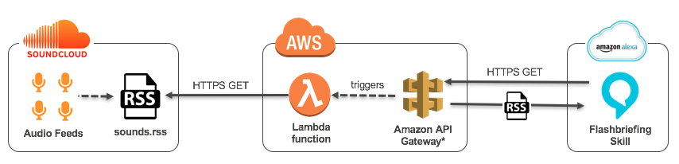

# Alexa Flash-Briefing Gateway for Soundcloud Podcasts

This gateway-service pulls your Soundcloud-RSS-feed and converts audio-feed-urls to HTTPS in order
to comply with SSL requirements for audio-feeds for Alexa Flash-Briefing skills. Secondly, the script
also picks the first configurable X items of your Soundcloud feed and returns it for your Flash-Briefing by
cutting off the trailing (likely outdated) feed items.

Before you start, make sure you configured your Podcast's RSS feed in Soundcloud ([Howto](https://help.soundcloud.com/hc/en-us/articles/115003570048-Setting-up-your-podcast-s-RSS-feed))

1. Deploy the Serverless-stack with "serverless deploy" in your CLI (don't forget to set AWS credentials in your environment). Adjust serverless.yml in case you want your stack be deployed in different AWS region than eu-west-1.

2. Use the AWS API-Gateway endpoint you'll find in the console output once your stack is deployed and use it as your Flash-Briefing skill-endpoint. You have to provide the Soundcloud-UserId as a GET parameter and optionally can limit the returned feed items to an individual max (by default it is set to 1 meaning only the top-most feed item in your Podcast will be returned).
 
### Example

When this is your RSS-feed-Url in Soundcloud:

_https://feeds.soundcloud.com/users/soundcloud:users:555123456/sounds.rss_

your Soundcloud-UserId is _555123456_. 

After your deployed your serverless stack in step 2) you should use the returned url and provide your Soundcloud-UserId as a GET parameter.
If you don't give it the uid-paramter the endpoints responds with an internal server error.

_https://xxx9t1mxxx.execute-api.eu-west-1.amazonaws.com/prod/feed?uid=555123456_

Optionally, you can limit the number of returned feed items (by default the limit is 1)

_https://xxx9t1mxxx.execute-api.eu-west-1.amazonaws.com/prod/feed?uid=555123456&limit=3_

